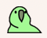
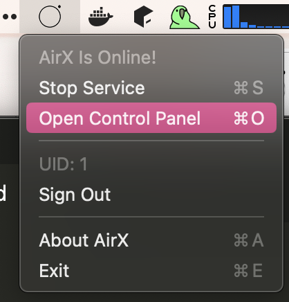

## 新增

[+] 最新改动放到github了

[+] 主界面菜单化，常态没有窗口浮在屏幕上，而是类似  一样在状态栏有个图标，点了有菜单，如下图。

这菜单可费老劲了

包含

- 开启和关闭服务
- 打开控制面板（也就是初版的主界面，被我作为控制面板了）
- 显示当前登入用户的UID
- 登入和登出，登入会弹出你设计的登入界面，登出会清除所有用户信息
- 关于
- 退出软件

[+] 剪贴板监控功能直接并入了`AirXService`，因为二者关系太密切，没必要分开。

[+] 临时有了一个图标 ，有了好看的版本之后再换。

[+] 部分接入了谷歌登录（走通了点击SignIn按钮 -> 弹出网页 -> 登录完事儿后进入回调函数、得到来自谷歌的token），后续这个token配合后端来使用。

[+] 收到文本后，能正确在屏幕角落弹出`Notice`窗口了。

[+] 实现了较为成熟的登录流程，自动登录AirX账号，登录一次后记住token，后续启动优先尝试续期token，若成功则直接自动登录。每次启动都会自动弹出Sign In窗口，除非自动登录成功则不弹。本地只保存token不保存密码。

[+] 工程重构了一遍，模块之间基本解耦，一些逻辑进行了升级（比如UserDefaults现在封装成类了，读写配置不再需要手写字符串，直接点出来），从仅仅能跑变为差不多能用。支持弹出和维护多个窗口，管理窗口大小什么的也都实现了。

[+] 更新了libairx，现在`OnTextReceived`函数的回调多了两个参数，分别是来源IP地址字符串及其长度。

## 可以和李成说说遇到的困难

对SwiftUI学习不够深入，基本上属于不看文档直接开干，因此吃了非常非常多的坑，往往是看似简单的事情，却需要花费大量时间去解决：

- 菜单图标坑：这应该是折磨时间最长的一个了，`MenuBarExtra`有几个官方没说的隐藏缺点，包括只能显示特定几种菜单项、生命周期函数全都无效（但是有）、若优先加载后会阻止窗口自动弹出等，网上相关资料也非常少。
- 状态共享坑：我折腾了一下午，最后chatgpt告诉我`ObservedObject`可以解决我所有的问题，这才脱离苦海。
- 多窗口坑：弹出窗口、设置窗口大小和位置、主动关闭窗口，以上几点操作，需要各不相同的特殊方法来做到。
- 防止多开：防止程序同时多开好几个，是很常见的需求了，谷歌居然一个相关结果都没有，震惊ᓫ(°⌑°)ǃ最后利用最最朴素的判断进程的方法解决了。
- 线程中更新UI坑：不能算是坑，所有语言都这样的，简单解决，但是这种错误有时候是概率发作，大意的话一时发现不了。

苹果的文档写的实在是比较简略，所以苦读文档倒也不如自己摸索。
